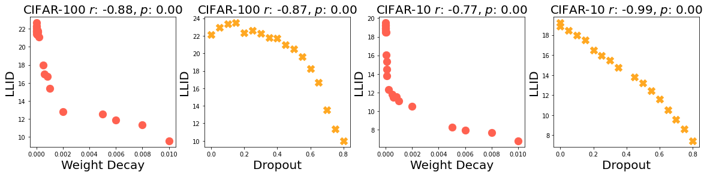
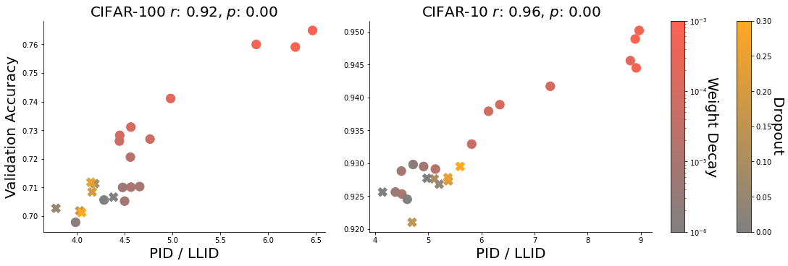
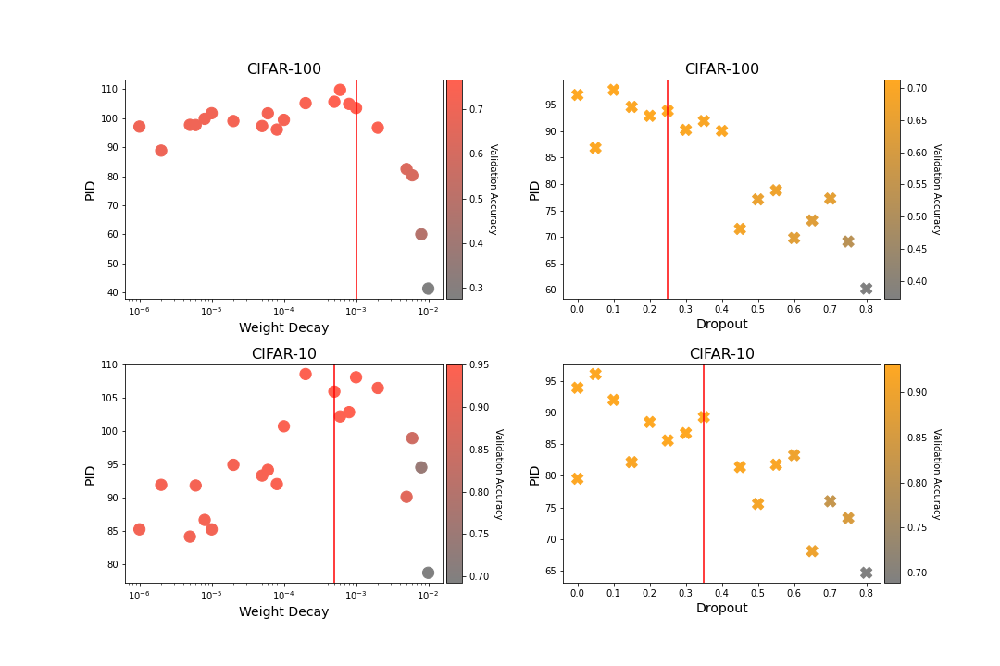
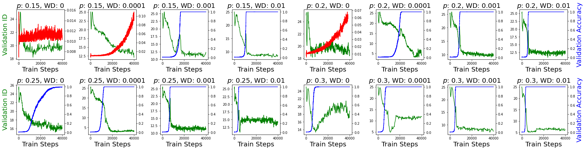

# Relating Regularization and Generalization through the Intrinsic Dimension of Activations

Code accompanying the NeurIPS 2022 [OPT](https://opt-ml.org/) and [HITY](https://hity-workshop.github.io/NeurIPS2022/) Workshop paper:

[**Relating Regularization and Generalization through the Intrinsic Dimension of Activations**]()<br/>
Bradley Brown\,
Jordan Juravsky\,
Anthony L. Caterini\,
Gabriel Loaiza-Ganem<br/>
[arXiv](https://arxiv.org/abs/2211.13239) | Video (Coming soon!)

This repository enables training CNNs and transformer models while measuring the intrinsic dimension of activations through training. 

## Requirements

First, install PyTorch according to the directions from the [PyTorch website](https://pytorch.org/). Then, you should be able to create and activate the [conda](https://docs.conda.io/en/latest/) environment:
```bash
conda env create -f env.yaml 
conda activate act_id
```
## Training Models

Run
```bash
python train.py +exp=EXP base_dir=BASE_DIR
```

Where EXP=(DSET)(OPT),

DSET is 
- "cifar10" or "cifar100" for training a ResNet-18 model on cifar10 or cifar100 respectively
- "math_equations_id" for training a transfomer model on the modular division mod 97 task

OPT is:
- empty for no intrinsic dimension tracking
- "_id" for tracking intrinsic dimension

and BASE_DIR is the root directory of the repo.

For example, to train on cifar10 while tracking id with the repo located at /act_ids, use:

```bash
python train.py +exp=cifar10_id base_dir=/act_ids
```

This project uses a combination of hydra for experiment configurations and pytorch lightning for model training. To see additional configuration options please see the "./config" folder.

## Displaying results on tensorboard

```bash
tensorboard --logdir outputs/
```

## Paper TLDR

Hypothesis: given a set of models that solve the problem on a representative set of data (ex. the training set), the one containing the simplest internal representations is more likely to generalize.

### How do you define simpler representations?

Given a neural network, $M$, with activation layers $\ell_1, \ell_2, ..., \ell_n$ and a dataset $D = \{x_1, x_2, ...\}$, let

```math
 A_i(D) = \{ \ell_i \circ ... \circ \ell_1(x): x \in D\}    
```

denote the set of activations from layer $\ell_i$ when evaluated on all the points in $D$ and ID$(S)$ denotes our ID estimate of a set of samples $S$. Using this, we define two measures of representational complexity:

- Last-layer Intrinsic Dimension (LLID) = $\max_{i = 1,\dots,n} \ ID(A_i(D))$

We use LLID to measure the complexity of the model's highest-level features that immediately precede the classification layer which we intuitively understand as the basis for the model's ultimate decision criteria.

- Peak Intrinsic Dimension (PID) = $ID(A_{n-1}(D))$

Peak ID measures an upper bound on the complexity of model activations across layers. [Existing work](https://arxiv.org/abs/1905.12784) shows that maximum ID occurs at early layers in the model, so we hypothesize that PID correlates with the richness of features that a model can extract from input data.

### Results

We find that regularization uniformly increases LLID and is correlated with lowering PID:



We then show that a small LLID and a large LLID are correlated with generalization accuracy, demonstrating that both a simple high-level representation and the ability to extract rich features are correlated with good performance:



Clearly, this can’t continue indefinitely. Over-regularized networks lack the ability to extract sufficiently rich features from input data as measured by PID. When regularization is too strong (right of the red line in each plot), Peak ID and validation accuracy both quickly drop:



Finally, we use the ID of activations to study the [grokking phenomenon](https://arxiv.org/abs/2201.02177), where small transformers networks trained on algorithmic datasets have been observed to rapidly generalize long after memorizing their training data.

We find that periods of rapid generalization are co-occurent with rapid drops in LLID, showing that the grokking phenomenon is associated with a rapid increase in internal representation simplicity:



## Acknowledgements

- Intrinsic dimensition estimation code from [ansuini](https://github.com/ansuini/IntrinsicDimDeep).
- Math equations dataset adapted from [Sea-Snell](https://github.com/Sea-Snell/grokking).

## BibTeX

```
@misc{https://doi.org/10.48550/arxiv.2211.13239,
  doi = {10.48550/ARXIV.2211.13239},
  url = {https://arxiv.org/abs/2211.13239},
  author = {Brown, Bradley C. A. and Juravsky, Jordan and Caterini, Anthony L. and Loaiza-Ganem, Gabriel},
  keywords = {Machine Learning (cs.LG), Artificial Intelligence (cs.AI), FOS: Computer and information sciences, FOS: Computer and information sciences},
  title = {Relating Regularization and Generalization through the Intrinsic Dimension of Activations},
  publisher = {arXiv},
  year = {2022},
  copyright = {Creative Commons Attribution 4.0 International}
}
```
